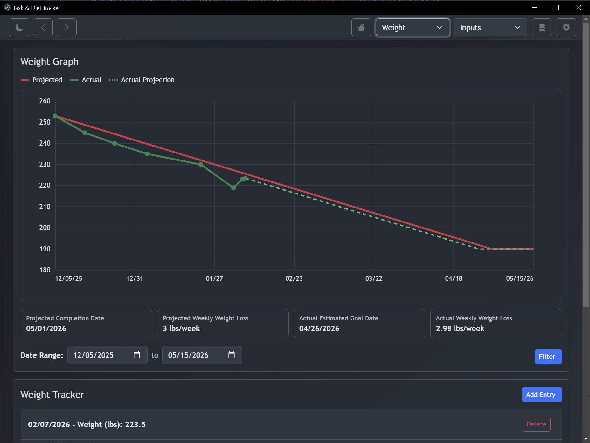
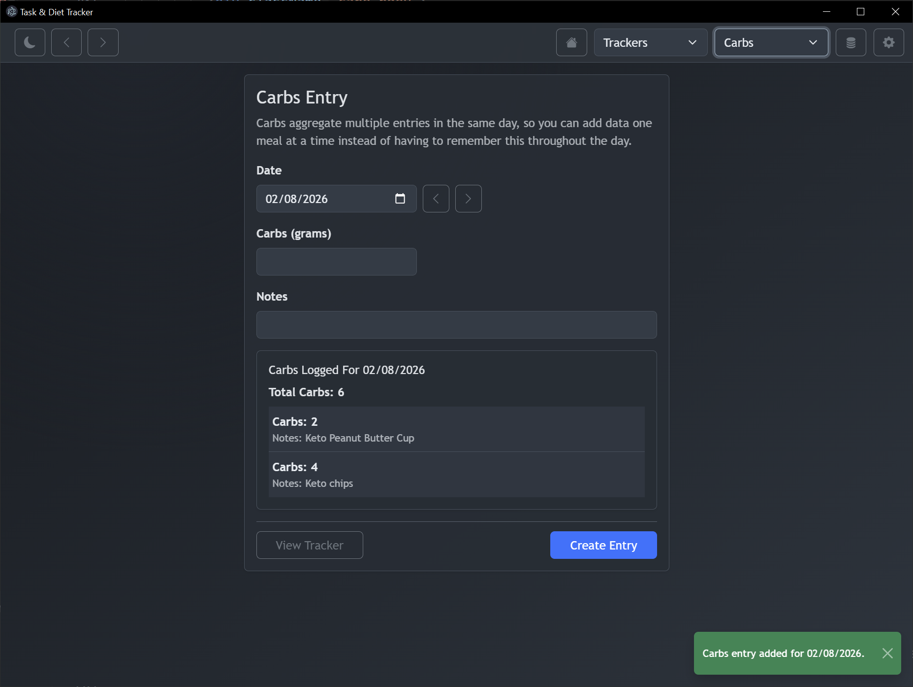
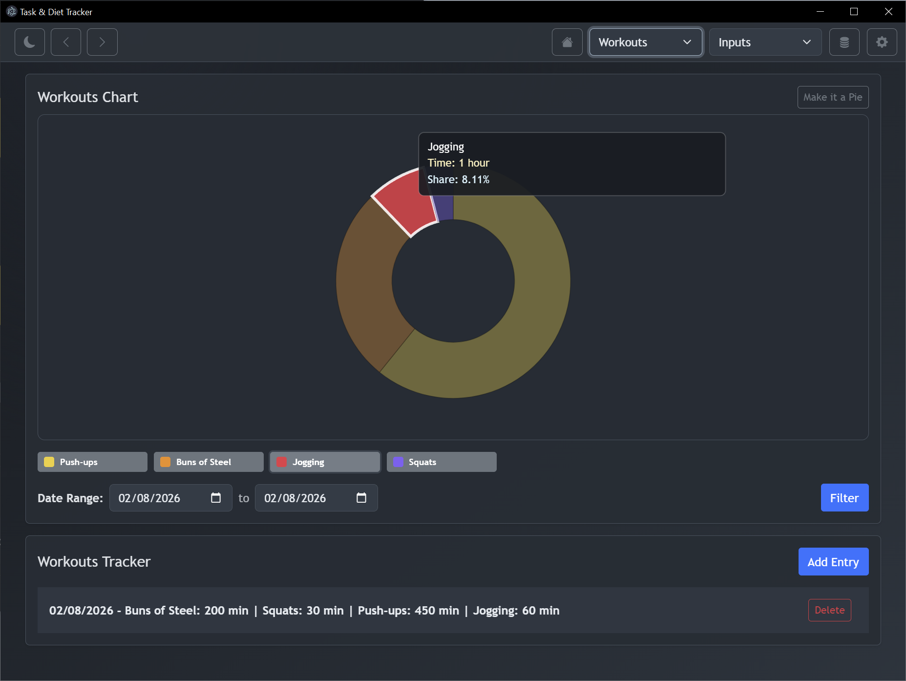

# Task & Diet Tracker

Desktop app for tracking diet and daily habits with local JSON storage, import/export, and visual charts.

Built with Electron + React + Vite + TypeScript + Bootstrap.

## Screenshots

### Weight Progress

### Carb Entry

### Workouts Composition

## Features

- Light and dark themes
- Home hub with quick access to tracker/input pages
- Dedicated input and tracker pages for diet/task categories
- Metadata management (workouts, subjects, students, chores, substances, entertainment)
- Multiple chart types (line, bar/stacked bar, histogram, pie/donut, mood box plot)
- Local JSON persistence with import/export from Settings
- Date-range filtering across tracker charts

## Windows Install (From Releases)

If you just want to use the app:

1. Go to Releases:  
   `https://github.com/jcGeorge/task_and_diet-tracker/releases`
2. Download the latest Windows release asset (zip).
3. Extract the zip.
4. Run the installer inside it (`TaskDietTracker Setup...exe`) and complete the wizard.

## Local Development

1. Install dependencies:
   `npm install`
2. Run in development mode:
   `npm run dev`
3. Optional production compile (no installer):
   `npm run build`

## Build Windows Installer (NSIS)

This builds the normal installer (not portable).

1. Install dependencies:
   `npm install`
2. Build installer:
   `npm run dist:win`
3. Output:
   `release-alt/`

## Data Storage

- App data is stored locally in `task-weight-data.json` under the app's user data directory.
- Import/Export in Settings includes tracker data and metadata.
